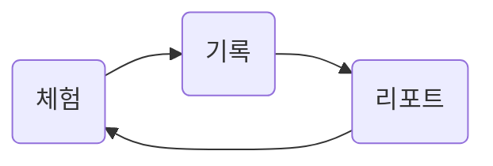

# 2023 생산성 COP
## 목표 :rocket: 
 - [X] ChatGPT 등 AI와 노코드 도구를 활용한 업무 생산성 향상 방법을 연구한다. :) 
---

### 멤버 :family: 
|이름|소속|사번|
|---|---|---|
|조원경|HR부|21282|
|조성우|청산결제업무부|20000|
|이지훈|경영기획부|20000|
|장효진|HR부|20000|
|조현성|금융채널서비스부|20000|
|채효신|HR부|20000|
---
#### 주요과제 :fire:
1. ChatGPT 등 생성형 AI 서비스에 관한 in-depth 리포트를 만든다.
2. QR기반 출석 체크 시스템 등 

